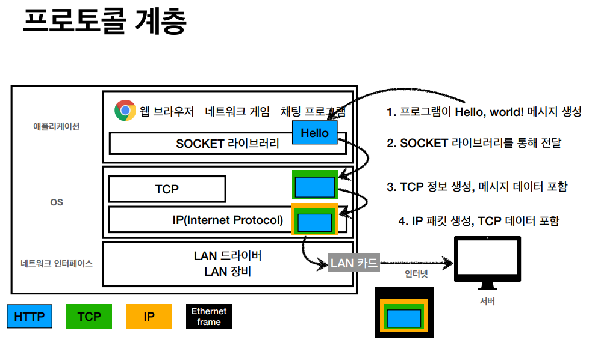
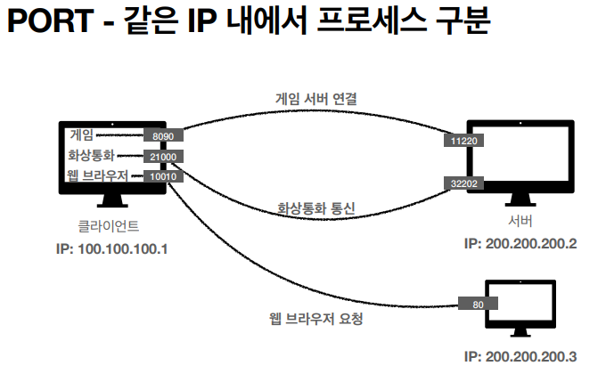
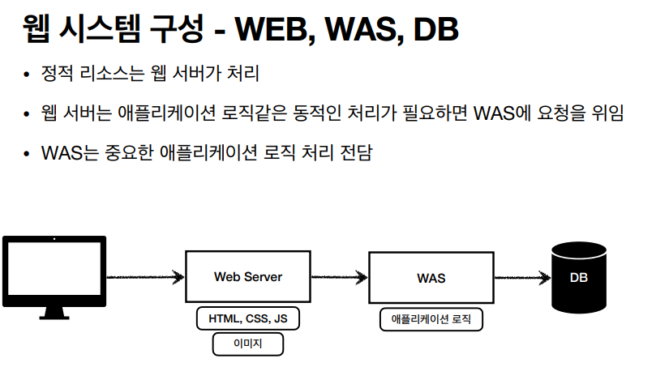

### 인터넷 통신

### IP

IP 프로토콜의 한계
- 비연결성
  - 패킷을 받을 대상이 없거나 서비스 불능 상태여도 패킷 전송 (일단 보냄)
- 비신뢰성
  - 중간에 패킷이 사라지면? 노드 탐색 오류
  - 패킷이 순서대로 안오면?
- 프로그램 구분
  - 같은 IP를 사용하는 서버에서 통신하는 애플리케이션이 둘 이상이면?

=> 이걸 해결하기 위해 TCP

### TCP

ip는 출발지 컴츄터 정보 only
=> tcp에서 아이피가 포함하지 않는 것을 포함함

TCP 특징
전송 제어 프로토콜(Transmission Control Protocol)
- 연결지향 - TCP 3 way handshake (가상 연결)
  1. SYN
  2. SYN+ACK (<- 서버)
  3. ACK (연결)
- 데이터 전달 보증
  1. 데이터 전송
  2. 데이터 잘 받았음(<- 서버)
- 순서 보장
  1. 패킷1, 패킷2, 패킷3 순서로 전송
  2. 패킷1, 패킷3, 패킷2 순서로 도착
  3. 패킷2부터 다시 보내
- 신뢰할 수 있는 프로토콜
- 현재는 대부분 TCP 사용

### UDP
- 연결지향 - TCP 3 way handshake X
- 데이터 전달 보증 X
- 순서 보장 X
- 데이터 전달 및 순서가 보장되지 않지만, 단순하고 빠름   
- **정리**
  - IP와 거의 같다. +PORT +체크섬 정도만 추가
  - 애플리케이션에서 추가 작업 필요

### PORT

- 0 ~ 65535 할당 가능
- 0 ~ 1023: 잘 알려진 포트, 사용하지 않는 것이 좋음
- HTTP - 80 (열려있음)

### DNS
도메인 네임 시스템 (중개인)
ip의 변경가능성 + 기억하기 어려움  
=> DNS는 ip주소를 DNS로 변환

## 2강 uri + 웹브라우저 요청 흐름

### URI(Uniform Resource Identifier)
- 리소스 식별
- url + urn 포함 but URN 사용X
- URL == URI
- 

scheme://[userinfo@]host[:port][/path][?query][#fragment]    
프로토콜  호스트명   포트번호(생략가능) 패스   쿼리 파라미터(ket=value)   
https://www.google.com  :443    /search  ?q=hello&hl=ko   

### wep
- server to server 통신도 http 사용한다
- 거의 모든 데이터 전송가능

*웹 서버 Web server*
- 정적리소스(변하지 않는 것/ 정적(파일) HTML, CSS, JS, 이미지, 영상)를 클라이언트한테 제공

*웹 애플리케이션 서버 WAS*
- 동적리소스(ex.블로그(비공개/친구공개/전체공개) 다 다르게 보임)
  - 앱을 넣어둘수도 있음?

was와 web server를 분리할 경우 was에 문제가 생겼을 때 web server에서 서버 점검중이라는 메세지 사용도 가능

요즘에는 클라우드 사용해서 증설필요X

### 서블릿
서블릿에 필드사용XXX

---

### http api
클라이언트 사이드 랜더링   
json - 공용어
클라이언트가 브라우저가 아니더라도 이해할 수 있음
클라이언트에서 할 일이 많아짐

서버사이드 렌더링, 클라이언트 사이드 렌더링
- SSR - 서버 사이드 렌더링*필수
  - HTML _최종 결과를 서버에서 만들어서_ 웹 브라우저에 전달
  - 주로 정적인 화면에 사용
  - 관련기술: JSP, 타임리프 -> 백엔드 개발자
- CSR - 클라이언트 사이드 렌더링
  - HTML 결과를 자바스크립트를 사용해 웹 브라우저에서 동적으로 생성해서 적용
  - 주로 동적인 화면에 사용, 웹 환경을 마치 앱 처럼 필요한 부분부분 변경할 수 있음
  - 예) 구글 지도, Gmail, 구글 캘린더
  - 관련기술: React, Vue.js -> 웹 프론트엔드 개발자
- 참고
  - React, Vue.js를 CSR + SSR 동시에 지원하는 웹 프레임워크도 있음
  - SSR을 사용하더라도, 자바스크립트를 사용해서 화면 일부를 동적으로 변경 가능

서버/디비/운영/배포

보안정보는 post
찾는 정보는 get?
main 아래 wepapp 경로 생ㅇ성
test.jsp 파일 생성하기
.jsp 파일은 html과 java코드 같이 작성할 수 있음